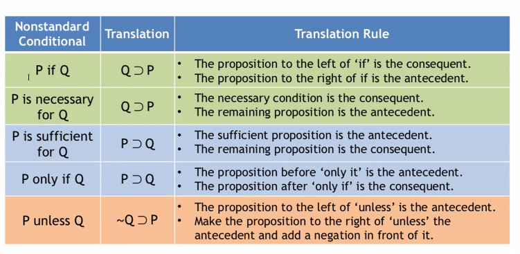

# 6/23/2021
# Language of Sentential Logic pt 2

### Necessary and sufficient conditions
A is a sufficient condition for B when the truth for A is enough to ensure B is also true:
- if a person has 10 kids, that is enough to say they are a parent
- if a shape is a square, that is enough to say the shape is also a rectange

A is a necessary condition for B when B cannot be true without the truth of A:
- in order for an animal to be a tiger, it must also be a cat.

Conditions can be both necessary and sufficient:
- having the flu virus is both necessary and sufficient for having the flu

Conditions may be debatable depending on their context and their "philosophical status" (questions of free will, determinism, religion, etc)

### If/then translations
Standard form for if/then is "If P, then Q" -> P &sup; Q

Many ways of expressing
- P is necessary for Q
- P is sufficient for Q
- P if Q
- P unless Q

A sufficient condition is the antecedent. It's truth guarantees the consequent.

An animal is a tiger &sup; Animal is a mammal

Necessary conditions are sort of evaluated in reverse:  
> Being a mammal is neccessary for being a tiger -> 
being a tiger is sufficient for being a mammal

T &sup; M  
P is necessary for Q -> Q &sup; P

For both necessary AND sufficient conditions, we use an "if and only if" statement:
P &equiv; Q

**IMPORTANT**: (P if Q) &ne; (P only if Q) &ne; (P if and only if Q)

"Unless" is a little weird:  
> A person can't rob a store unless they break the law ->  
If a person follows the law, then they can't rob a store

~B &sup; R

**IMPORTANT: "Since" versus "if/then"**  
Since is a premise indicator, whereas an if/then is NOT an argument.  
“Since Iris is 21, she can drink legally.” &ne; “If Iris is 21, then she can drink legally.”

### Non-standard "and" statements
All of these are simply (P & Q):
- Both P and Q 
- P but Q 
- P whereas Q 
- P however Q 
- P nevertheless Q 
- P moreover Q

### Negating "or" & "and"
Negations cannot be simply distributed across parentheses:  
~(P & Q) &ne; ~P & ~Q  
rather,  
~(P & Q) = ~P v ~Q

Example:  
> It cannot be the case that both Trump and Biden are president; either Trump loses or Biden loses

~(B & T) = ~B v ~T

To reiterate:  
~(P v Q) = ~P & ~Q  
~(P & Q) = ~P V ~Q

~(P v Q) &ne; ~P v ~Q  
~(P & Q) &ne; ~P & ~Q

### Main Topics
- Watch out for non-standard conditionals and conjunctions.
- Keep in mind that ‘only if’ and ‘if and only if’ are not the same. 
- Be careful with negations.  ‘Not both P and Q’ is not the same as ‘Both not P and not Q.’