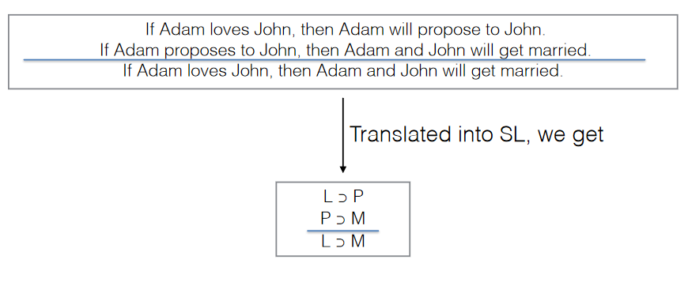
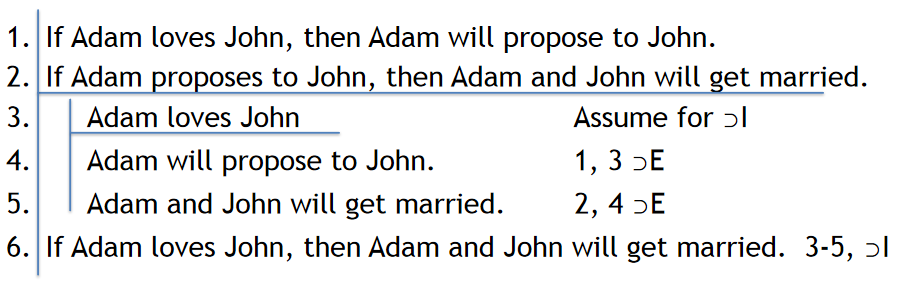

# 7/1/2021  
# Natural Deduction Requiring Sub-derivations

We learned about rules of inference which do not require sub-derivation:
- Reiteration
- Double negation (discussed in text)
- & Introduction / Elimination
- &or; Introduction / Elimination
- &sup; Elimination
- &equiv; Introduction / Elimination

## Introduction and Elimination rules
Introduction rules are used to construct a certain type of sentence in our proof. For example, &-introduction tells us we can use any line previously given or derived to construct new statements. Conversely, elimination rules are used to break apart or "distill" a larger statement into smaller parts.

## The Need For Horseshoe Introduction
If we have an argument constructed of conditional premises, we will likely end up with a conditional conclusion. To prove this conclusion, we will need to be able to construct conditionals.

A conditional claim L &sup; M simply says that "if L is true, then M is true." We therefore don't need to prove that either L or M are true. Instead, we need to show that, logically, it follows that if L is true, then so is M.

Example:  

This is where scope lines get important. Sub-derivations may be opened by using an assumption, as long as it is closed by the same sub-derivation which follows the assumption.

At any point in a proof, you can introduce a sub-derivation. It is important, then, that every sub-derivation is closed before reaching a conclusion. Once a sub-derivation is closed, the lines within it are off-limits!

## Reductio Ad Absurdum (~ Introduction)
We can use an assumption to reach the negation of a premise, which introduces a contradiction and proves the negation of the assumption. For instance:
> If Trump is the President, the President is a Republican. However, the President is a Democrat.

We can use the assumption that Trump is the President to infer that a Republican is President, using horseshoe elimination. That inference is then disproven using the premise that the President is a Democrat. Therefore:
> Trump is not the President.

~E and ~I are basically the same rule. That’s why they are both called “Reductio ad Absurdum”

## The Underlying Assumption Behind ~I/~E
- **The Law of Non-Contradiction:** A sentence cannot be both true and not true at the same time and in the same sense.
- We express this law in Sentential Logic as ~(P & ~P) 
- So, if a sentence implies a contradiction, we know that it must be false, because if it were true it would violate the law of non-contradiction.
- Not only is Sentential Logic based in part on the law of non-contradiction; so too is much of mathematics.

## Early Strategy for Sub-derivations
We have 3 rules currently to open and close sub-derivations: &sup;I, ~I, and ~E
- If the conclusion is a conditional, then we can use &sup;I to arrive at the conclusion, using the antecedent as our assumption case.
- If the conclusion is a negation, we can use ~I and ~E and assume the negation conclusion is false (i.e. if ~A is our conclusion, assume A is true). Additionally, negation elimination can be used in proving a conclusion which isn't a negation; if A is the conclusion, try assuming ~A and then use a sub-derivation involving ~I or ~E.