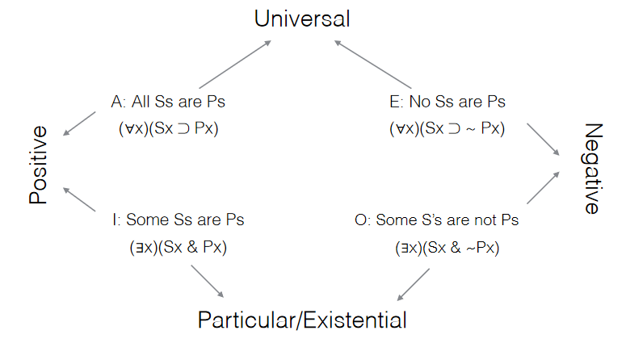

# 7/14/2021
# Restricted and Overlapping Quantifiers

To recap, predicate logic (in a very simplified definition) takes sentential logic, adds quantifiers, and separates the atomic sentences into subjects and predicates.

## Restricting the Domain
How do we take a portion of the domain for consideration? For instance, if we have a domain of everything in the world, and we want to indicate that a person loves all dogs, we must take a group, or subset, out of the domain of all things.

Thus, we can specify the group that we want to capture, then use the if/then statement to take the subset of a larger set, creating a **restricted quantifier**:

Domain: **{Everything}**  
Let:  
**Lxy** = x love y,  
**Px** = x is a person,  
**f** = Frank

> Everyone loves Frank 

**(&forall;x)(Px &sup; Lxf)**

### The Square of Opposition
Aristotle coined the term "categorical proposition," laying out 4 cases for groups of things and their qualities:
- All objects have a property (**A**)
- No objects have a property (**E**)
- Some objects have a property (**I**)
- Some objects do not have a property (**O**)

**A-Sentences** are translated as above, using the if/then statement.

**I-Sentences** use the "and" statement to indicate two true cases:

Domain: **{Animals}**  
Let:  
**Hx** = x is a horse 
**Bx** = x is brown

> Some horses are brown

**(&exist;x)(Hx & Bx)**

### Compound Subjects and Predicates
Sometimes we'll need to describe multiple subjects or multiple properties, or sets of a group of objects with a certain property, which also have another property.

> Every horse is either brown or black.  

- The subject of the sentence is "horses."
- The predicate is "is either brown or black."

**(&forall;x)[Hx &sup; (Bx v Rx)]**

> Every horse that is black is on a diet.

- The subject of the sentence is "horses that are black."
- The predicate is "is on a diet."

**(&forall;x)[(Hx & Bx) &sup; Dx]**

## Overlapping Quanitifiers
We will encounter quanitified groups which are a relation of another quantified group.

Domain = **{Robin, Martin, Leif}**  
Let:  
**Lxy** = x loves y

> Everyone has someone they love

**(&forall;x)(&exist;y)Lxy**

This says that all of the following are true:
- Robin loves either Robin, Martin or Leif
- Martin loves either Robin, Martin, or Leif
- Leif loves either Robin, Martin or Leif

> Someone is loved by everyone

**(&exist;x)(&forall;y)Lyx**

The says that at least one case is true:
- Robin is loved by Robin, Martin and Leif
- Martin is loved by Robin, Martin, and Leif
- Leif is loved by Robin, Martin and Leif

### Overlapping and Scope
Quantifiers can be considered connectives. Thus, the scope of a quantifier is still the first well-formed sentence to its right, even if there exists other quanitifers in that scope.

Domain = **{All People}**  
Let:  
**Lxy** = x loves y

> Everyone has someone they love.

**(&forall;x)(&exist;y)Lxy**

>There is at least one person who is loved by everyone. 

**(&exist;y)(&forall;x)Lxy**

## Combining Restricted and Overlapping Quantifiers

Domain: **{Everyone who works at SMC}**  
Let:  
**Fx** = x is a faculty member
**Ax** = x is an administrator
**Exy** = x earns more than Y

> Every administrator earns more than some faculty member.

This says that, for all people who work at SMC, all of those that are administrators earn more than someone who is a faculty member. So:

(&forall;x)(Ax &sup; (&exist;y)(Fy & Exy))

In English, for all employees, if an employee is an administrator, then there exists at least one employee who is a faculty member, and the administrator earns more than the faculty member. This is equivalent to our original statement.