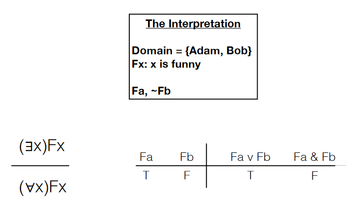

# 7/19/2021
# Proving Invalidity in Predicate Logic

##### Recall:

###### Expansions
Universally quantified sentences can be **expanded** to a series of conjunctions (&) for each member of the domain, and existential quantified sentences can be expanded to a series of disjunctions (&or;) for each member of the domain. With overlapping quantifiers, care must be taken to expand only the well-formed formula(s) under each quantifier's scope.

###### Interpretations
An **interpretation** is a defined model of a sentence, with not only domain and subject/predicate definitions but also **truth-values** for specific cases. We can then determine the truth-value of the sentence in a particular interpretation. A predicate carries no inherent truth-value; it only has a truth-value in relative to some interpretation.

## Validity in Predicate Logic
An argument is valid if and only if it is impossible for any argument to have all true premises and a false conclusion. We could deduce *invalidity* in sentential logic by looking for such rows in a truth table where all premises are true and a conclusion is false. In predicate logic, we will take a similar approach and attempt to eliminate all possible invalid cases to prove validity. If we can find an interpretation where all premises are true and the conclusion is false, the argument is considered invalid. Such a case is called a **counterexample,** just like in sentential logic and truth tables.

## Demonstrating Invalidity
In order to construct an interpretation in which the argument is invalid, we must first consider our domain. The goal is the *minimum* amount of elements in a domain in order to make each premise true and the conclusion false. From there, the premises and conclusion can be expanded and compared. Invalidity can then be proven by finding truth-values in which the premises are all true and the conclusion false.

The tough part in proving invalidity using this method is coming up with the ideal interpretation. It can be difficult sometimes to come up with a model in which the premises are true and the conclusion false. There are two scenarios where this difficulty usually presents itself:
- The argument is actually valid and it is impossible to come up with an interpretation as a counterexample
- The argument is invalid, but the domain selected does not cover invalid cases.

### Working with Overlapping Quantifiers
We follow the same algorithm in proving invalidity when overlapping quantifiers are involved; the additional labor is completing the expansion for these sentences. The process of selecting a domain is also slightly different - in an argument involving a sentence where the existential quantifier is the main connective, the domain must consist of at least one element.

## Main Ideas
- Know how to prove that an argument is invalid by 
constructing an interpretation of the argument on 
which the premises come out as true and the 
conclusion comes out as false.