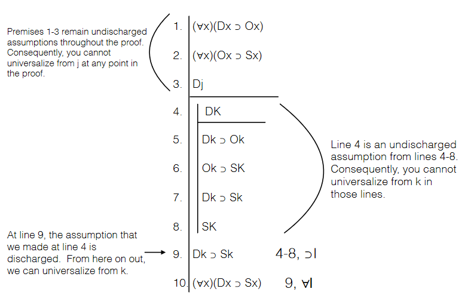
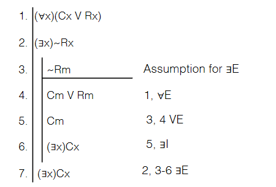
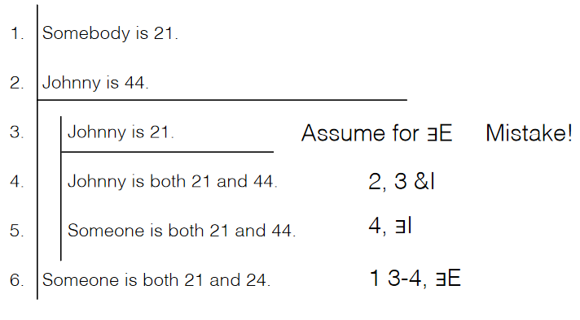
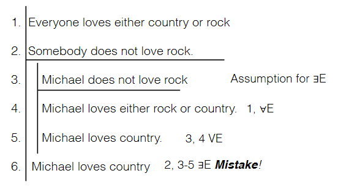
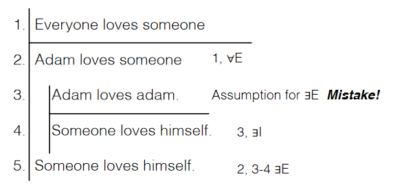

# 7/26/2021
# Derivations in Predicate Logic part 2

#### Recall:
All of our natural deduction tools from sentential logic are applicable to predicate logic. We just need to introduce 4 additional rules for quantifiers.

## Universal Introduction
If we have a case where a predicate is stated as true in a premise, we cannot simply jump to saying that predicate applies to the entire domain. Rather, it is required to show that the predicate is true for all members, by using a random member of the domain which is **not** used in the premises. The *randomness* of our choice for a substitution instance shows that the predicate would apply to any subject choice. This random assumption is justified given that the subject does not occur in an **undischarged assumption** - that is, the subject is not involved in the premises for the predicate we are considering, and the subject is not involved in initial assumptions in a sub-derivation. Remember, a variable is only discharged when a sub-derivation is closed (and variables which occur in a premise cannot be discharged).

## Existential Elimination
In assuming that a predicate applies to a subject, we *cannot* simply asssume that a random substitution instance is true. Rather, we must contain that assumption in a sub-derivation. From there, we can use the assumption in deriving some other predicate.

Similarly to universal elimination, we must make sure that the random substitution instance is not an undischarged assumption - the subject must not be involved in premises, **AND** the subject cannot be involved in our initial existentially quantified claim, **AND** the subject must not occur in the result of the sub-derivation.

