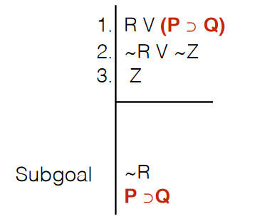
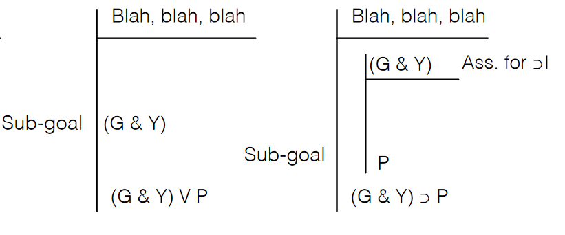
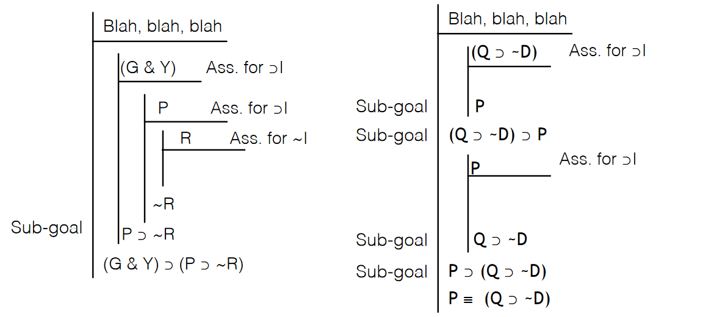

# 7/6/2021  
# Strategies for Derivations

## Top-Down Strategy
By examining the premises first, we can get to the conclusion
- Look for the conclusion as part of one of the premises
- If so, try to *eliminate* the other parts of the relevant premise
- If you cannot immediately use elimination, think about *sub-goals* and relevant sub-derivations you can use to get to that point

## Bottom-Up Strategy
If the conclusion is not recognizable from premises or parts of premises, we'll have to identify premises (or their parts) as sub-goals.
- Identify the main connective of the conclusion. Think about the introduction rule for that connective, and set up sub-goals from the parts of the connected conclusion.
- Repeat as often as needed until the sub-goals are recognized in the premise, and proceed by using the Top-Down strategy

**Remember:** If the main connective of the conclusion is either a conditional or a negation, you will likely need at least one sub-derivation.

## Multiple sub-derivations
You can have both nested sub-derivations as well as multiple subderivations.

As we nest deeper into multiple sub-derivations, the scope line accuracy becomes increasingly important!