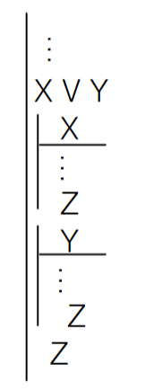
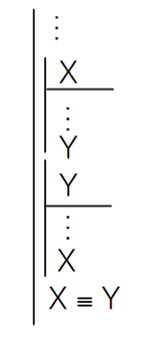

# 7/6/2021
# Rules of Replacement and Derived Rules

These last two topics in sentential logic will provide some shorthand methods in natural deduction.

## Derived Rules
So far, all of the rules we've learned are known as *primitive rules,* since they can be proved to be valid in a straightforward way by using truth tables. In this sense, any rule which can be proved by a truth table can be labeled a primitive rule.

Using the primitive rules, we can build upon our inference toolbox and use shortcuts to get to our conclusions faster. This does assume knowledge of, and acknowledgement of the validity of, primitive rules, but the deductions we can write from here on out are much less tedious & verbose.

**The following rules do not require sub-derivations:**

### Hypothetical Syllogism (HS)
If we have two conditionals, where the consequent of one is the antecedent of the other, we can link the other antecedent and consequent also:

1. X &sup; Y  
2. Y &sup; Z  
_-_-------------  
3. X &sup; Z

### Denying the Consequent (DC)
If we have a statement which states that a consequent in another conditional statement is false, then we can safely say that the antecedent of that conditional is also false:

1. X &sup; Y  
2. ~Y  
_-_-------------  
3. ~X

On the contrary, "affirming the consequent" or "denying the antecedent" is NOT valid logic:

1. X &sup; Y  
2. Y  
_-_-------------  
3. X **WRONG!**

---------------

1. X &sup; Y  
2. ~X  
_-_-------------  
3. ~Y **WRONG!**

### Weakening (W)
A conditional can be derived by assigning a statement as the consequent of that conditional:

1. X  
_-_-------------  
2. Y &sup; X

As in DC, weakening cannot go both ways:

1. X  
_-_-------------  
2. X &sup; Y **WRONG**

This is similar to &or;I where we go from a strong claim to a weaker claim, and it isn't very intuitive, but it can be useful in some cases.

### Biconditional Elimination II (&equiv;E)
We no longer have to break a biconditional into its conditional parts in order to prove a part of the biconditional:

Instead of:

1. X &equiv; Y  
2. X  
_-_-------------  
3. X &sup; Y 1, &equiv; E  
4. Y 2, 3 &sup; E

We can simply write:

1. X &equiv; Y  
2. X  
_-_-------------  
3. Y

------------------------

**The following rules require sub-derivations**

### Argument by Cases (AC)
If a premise or derived line is an &or; statement, and it can be shown that assuming truth for both parts of that statement (in sub-derivations) results in another variable with a true value, then you can conclude that the other variable is also true:

### Biconditional Introduction II (&equiv;I)
If we have two sub-derivations, which each assume one side of a biconditional, and we can derive the other side of the biconditional in each sub-derivation, then we can prove the truth of the biconditional. Wordy, but it makes sense, and it saves us the steps of having to explicitly state two sepearate conditionals.

## Rules of Replacement
We can re-arrange statements in order to manipulate them in an easier way.

- **De Morgan's Rule (DM):** A negated and/or statement is the negation of each variable connected by or/and:
  - ~(P v Q) = ~P & ~Q
  - ~(P & Q) = ~P v ~Q
- **Contraposition (CP):** A conditional is equivalent to a conditional involving the negations of the original antecedent and consequent:
  - P &sup; Q = ~P &sup; ~Q
- **Material Conditional (MC):** A conditional can be converted to an &or; statement:
  - P &sup; Q = ~P v Q
- **Negated Conditional (NC):** A conditional inside a negated parentheses set can be converted to an and statement:
  - ~(P &sup; Q) = P & ~Q
- **Double Negation:** Straightforward enough:
  - ~~P = P
- **Commutation (Com):** The commutative property in math has its analogue here:
  - P v Q = Q v P
  - P & Q = Q & P

## Main Points
Memorize and be able to use the derived rules:
- Hypothetical Syllogism
- Weakening
- Denying the Consequent
- Argument from Cases
- Biconditional Elimination II
- Biconditional Introduction II

Memorize the rules of replacement:
- De Morgan’s
- Contraposition
- Conditional Rules
- Double Negation